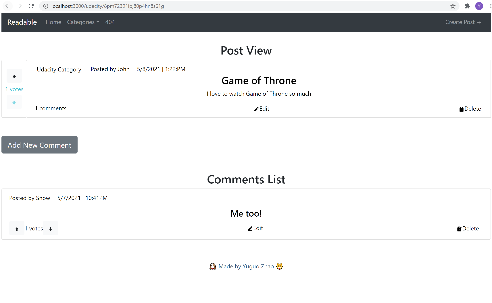
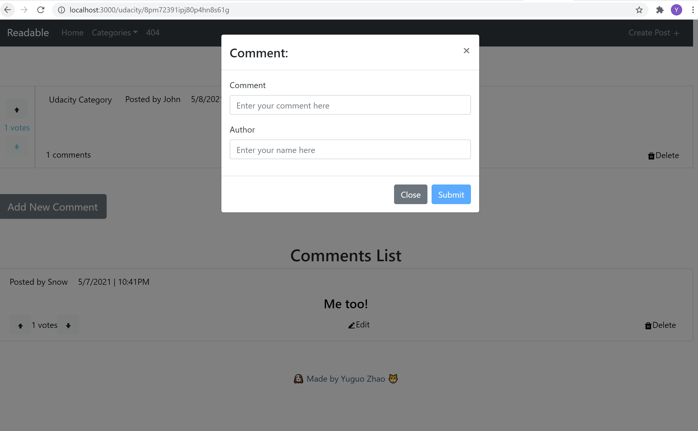

# Readable Project

This is the project for Udacity's React & Redux course. I build a React/Redux front end for the application. I used [Create React App](https://github.com/facebook/create-react-app) and [React-bootstrap](https://react-bootstrap.github.io/) to bootstrap this project.

## Get Started

* To get this project, type `git clone https://github.com/cheerworld/Readable-Project.git` in your terminal and `cd Readable-Project` into your project.

To get started developing right away:

* Install and start the API server
    - `cd reactnd-project-readable-starter/api-server`
    - `npm install`
    - `node server`
* In another terminal window
    - `cd readable-frontend`
    - install all project dependencies with `npm install/yarn add`
    - start the development server with `npm/yarn start`

## App View

 
 ### Home View
 Home view shows you a list of posts with brief information. You can upVote or downVote this post. There are 4 ways for you to sort posts, it includes sort by highest or lowest votes and sort by latest or oldest date. You can click on each post to view the details of each post. There is a navigation bar at the top of each view. You can navigate to home, to an individual category, and to create a post.

 
 ### Individual Category View
 The individual category view is identical to the home view but filtered to only include posts with the selected category.

 
 ### Create A Post View
 Create a post view is a form for you to enter your post information, it includes title, text, author, and category to choose from. When you click "edit" for a post, create a post view will also show, existing data will be populated in the form. All the inputs are required to fill out, or you won't be able to submit the new post.

 
 ### Post Detail View
 In the post detail view, you can see the details of the post, upVote or downVote, edit and delete this post. There is a button to add a new comment. You can see a list of comments for this post. You can upVote or downVote, edit and delete for each comment.

 
 ### New Comment Modal View
 When you click the add comment button, the new comment modal will show. You need to fill out both comment and author inputs to be able to submit a new comment. This modal will also show when you click "edit" on a comment, existing data will be populated in the form.

 
 ### Error Page 404 View
 When a user goes to a deleted post’s URL, a 404 page is displayed. 

## More Information
 There is more information regarding the API server in
  [README file](reactnd-project-readable-starter/api-server/README.md)
 , and how to create a React App in
  [another README file](readable-frontend/README.md).
